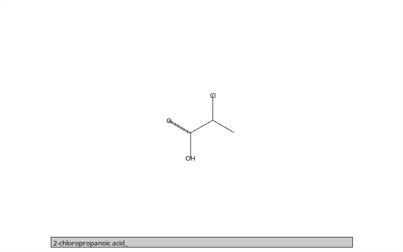

# Organic Chemistry Practice

A simple quiz program for practice naming organic molecules

## Building/Dependencies

This requires python3 (it will not work with python2) and tkinter for the graphics. With `apt`, you can get the `python3-tk` package.

To run the program, use `python3 organicChemPractice.py`

## Features/Operation

After typing the molecule name into the box, press `Enter` to check your work.  If the answer is correct, it will generate a new molecule, but if incorrect, the box will highlight red, and you can try again.

If unsure of an answer, press `Tab` and a new molucule will be brought up. The correct answer of the skipped question will be printed to the terminal.

## Limitations

I made this project to study for a short organic unit at the end of a chemistry class, so this program reflects what I had to learn for that class and by no means encompases all of the possibilities. As this is not my area of expertise, I apoligize for any inaccuracies, and I the following is a list of the limitations I am already aware of:
- Stereoisomerisms: the program ignores any identifiers needed to identify the isomer (trans, cis, R, S, etc.); therefore, some of the generated names will be incomplete in this way
- Cyclic molecules: the program will not generate any cyclic molecules; I have experimented with this feature and might try to add it at some point
- Naming convention: the program follows strict naming conventions and will not accept common or alternate names (ie. you must type `ethanoic acid` instead of `acetic acid`).  If you think you are correct but the program marks it wrong, check with a reliable source
- Impossible molecules: the program is only concerned with generating molecules that can be systematically named. Consequently, it may produce ridiculous molecules that do not exist in the real world.